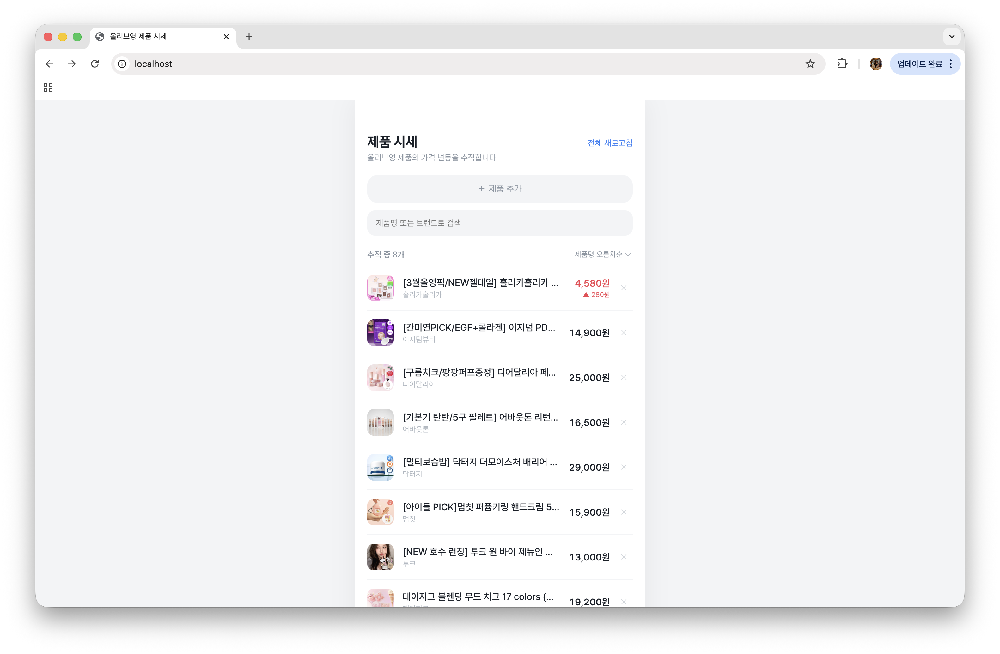
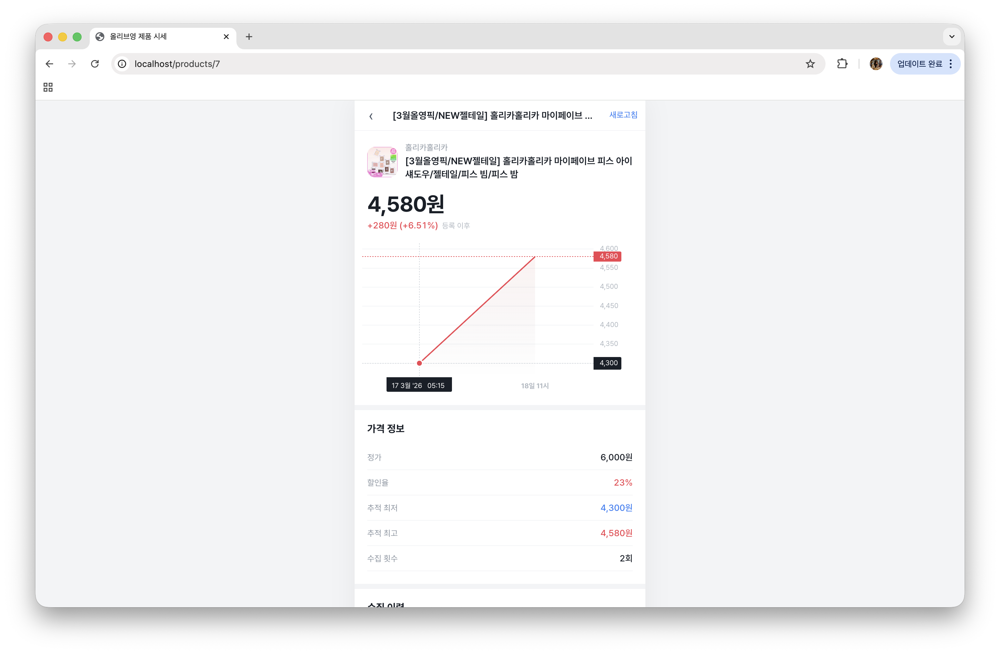

# 🫒 product-price-tracker

상품 URL을 등록하면 가격을 주기적으로 수집하고, 주식 차트 스타일로 가격 변동을 시각화하는 웹 애플리케이션입니다.

> **Claude Code로 작업하는 경우** — `CLAUDE.md`와 `CONVENTIONS.md`를 함께 읽어주세요. 크롤러 생성·수정 워크플로우, 레이어 규칙, 커밋 컨벤션이 정의되어 있습니다. 크롤러는 AI 하네스 기반으로 자동 생성됩니다 (하단 크롤러 안내 참조).

> ### **⚠️ 꼭 읽어주세요!**
> * 이 프로젝트는 **개인적으로 공부하고 포트폴리오를 만들기 위해** 제작한 프로젝트입니다. **수익을 내거나 상업적으로 이용할 목적은 전혀 없습니다!**
> * 서비스 이용 약관과 `robots.txt` 규정을 확인하고 준수하여 개발했습니다.
> * 올리브영(CJ 올리브네트웍스)의 상표권과 모든 데이터 권리는 해당 기업에 있습니다. 해당 프로젝트는 공개된 페이지의 가격 정보만 추적할 뿐이며, 수집된 원본 데이터는 외부로 대량 전송하거나 상업적으로 재배포하지 않습니다.
> 
> 혹시나 제가 놓친 저작권 문제나 정책 위반 사항이 있다면, 번거로우시겠지만 [제 이메일](mailto:cinnamein@gmail.com)로 꼭 연락 부탁드립니다! 확인하는 대로 바로 수정하도록 하겠습니다. 감사합니다:)

---
 
## 주요 기능
 
- **제품 등록** — 제품 URL 입력만으로 제품 정보 자동 수집
- **가격 추적** — 주기적 크롤링으로 가격 이력 저장 및 변동 감지
- **차트 시각화** — TradingView Lightweight Charts 기반 인터랙티브 가격 추이 차트
- **가격 통계** — 현재가, 최저가, 최고가, 등락률 한눈에 확인
- **검색 & 정렬** — 제품명/브랜드 검색, 가격·이름 기준 오름차순/내림차순 정렬
- **같은 시간대 데이터 병합** — 동일 시간 내 중복 수집 시 최신 값으로 자동 갱신
 
## 기술 스택
 
| 구분 | 기술 |
|------|------|
| Frontend | Next.js (App Router), TypeScript, TailwindCSS, TradingView Lightweight Charts |
| Backend | FastAPI, SQLAlchemy (ORM), Pydantic (데이터 검증) |
| Database | SQLite (PostgreSQL 전환 가능하도록 설계) |
| Infra | Docker, Docker Compose, Nginx (리버스 프록시), GCP Compute Engine |
| Design | 카카오페이 증권 UI 참고 — Pretendard 폰트, 모바일 퍼스트 레이아웃 |
 
## 아키텍처
 
```
┌─────────────────────────────────────────────┐
│                  Nginx                      │
│          (리버스 프록시 / 로드밸런서)             │
│                                             │
│    /          →   Next.js (프론트엔드)         │
│    /api/*     →   FastAPI (백엔드 API)        │
└─────────────────────────────────────────────┘
                      │
               ┌──────┴──────┐
               │   SQLite    │
               │  (가격 이력)  │
               └─────────────┘
```
 
- Docker Compose로 프론트엔드, 백엔드, Nginx를 한번에 관리
- Nginx가 경로 기반으로 트래픽을 분배하여 단일 포트로 서비스
- 크롤링 서비스는 분리하여 외부에서 API를 통해 데이터 수집
 
## 스크린샷


 
### 메인 페이지 (제품 리스트)
- 등록된 제품의 현재 가격과 등락 표시 (▲ 빨강 / ▼ 파랑)
- 제품명/브랜드 실시간 검색
- 가격순, 이름순 정렬


 
### 상세 페이지 (가격 차트)
- TradingView 스타일 인터랙티브 라인 차트
- 상승/하락에 따라 차트 색상 자동 변경
- 가격 정보 (정가, 할인율, 추적 최저/최고)
- 수집 이력 테이블
 
## 프로젝트 구조
 
```
├── backend/
│   ├── app/
│   │   ├── main.py              # FastAPI 앱 진입점
│   │   ├── config.py            # 환경 설정
│   │   ├── database.py          # DB 연결
│   │   ├── api/products.py      # REST API (CRUD + 크롤링 트리거)
│   │   ├── models/product.py    # SQLAlchemy ORM 모델
│   │   ├── schemas/product.py   # Pydantic 요청/응답 스키마
│   │   ├── scraper/             # 크롤러 (gitignore 제외, 하단 안내 참조)
│   │   │   ├── service.py       # 크롤링 + DB 저장 서비스 (커밋 대상)
│   │   │   ├── __init__.py      # URL → 크롤러 라우터 (gitignore)
│   │   │   ├── {사이트명}.py     # 사이트별 크롤러 (gitignore)
│   │   │   └── url.txt          # 수집 대상 URL 목록 (gitignore)
│   │   └── scheduler/           # 자동 크롤링 스케줄러
│   ├── Dockerfile
│   ├── requirements.txt
│   └── .env.example
├── frontend/
│   ├── src/
│   │   ├── app/                 # Next.js App Router 페이지
│   │   │   ├── page.tsx         # 메인 (제품 리스트)
│   │   │   └── products/[id]/   # 상세 (가격 차트)
│   │   ├── components/          # PriceChart 등 UI 컴포넌트
│   │   └── lib/                 # API 클라이언트, 포맷 유틸
│   └── Dockerfile
├── nginx/
│   └── nginx.conf               # 리버스 프록시 설정
├── docker-compose.yml
└── README.md
```

## ⚠️ 크롤러(Scraper) 관련 안내

크롤링 로직은 무분별한 악용을 방지하기 위해 레포지토리에 포함하지 않았습니다.
클론 후 아래 절차에 따라 크롤러를 직접 생성해야 합니다.

### 1. 초기 세팅

```
1. backend/app/scraper/url.txt 생성 — 수집할 상품 페이지 URL을 한 줄씩 입력
2. Claude Code(claude.ai/code)로 프로젝트를 열고 아래 프롬프트 입력:
   "scraper/url.txt의 URL을 분석해서 {사이트명}.py 크롤러를 생성해줘."
3. AI가 크롤러 파일과 __init__.py를 자동 생성
4. docker compose up -d 로 실행
```

CLAUDE.md에 크롤러 생성 워크플로우와 규칙이 정의되어 있습니다. Claude Code가 이를 읽고 자동으로 따릅니다.

### 2. 멀티 사이트 구조

URL 패턴으로 사이트를 자동 판별해 크롤러를 라우팅합니다.

```python
# __init__.py
SCRAPERS = [
    (oliveyoung_URL_PATTERN, _oliveyoung_scrape),
    (ably_URL_PATTERN,       _ably_scrape),
    # 신규 사이트 추가 시 여기에 등록
]
```

각 크롤러 함수의 반환 형태:
```python
{
    "name": "제품명",
    "brand": "브랜드명",
    "price": 9970,            # 필수
    "original_price": 20000,  # 없으면 None
    "discount_rate": 50,      # 없으면 None
    "image_url": "https://..."
}
```

### 3. 동작 방식

상품 등록(POST /products) 시 크롤러가 즉시 실행됩니다.
이후 스케줄러가 주기적으로 가격을 갱신합니다.

### 4. 주의 사항

- 서비스 이용 약관 및 robots.txt를 반드시 준수해야 합니다.
- 서버에 무리가 가지 않도록 소량의 요청을 충분한 시간 간격을 두고 실행해 주세요.

## 실행 방법
 
```bash
# Docker Compose로 실행
docker compose up -d --build
```
 
환경 변수 설정이 필요합니다. `.env.example`을 참고하세요.
 
## 설계 포인트
 
### 백엔드
- **Upsert 패턴**: 같은 시간대 중복 크롤링 시 기존 데이터를 업데이트하여 불필요한 데이터 증가 방지
- **메타 정보 캐싱**: 제품명/브랜드/이미지가 이미 수집되어 있으면 이후 크롤링에서 가격만 수집하여 성능 최적화
- **Eager Loading**: `subqueryload`로 N+1 쿼리 문제 해결
- **KST 시간대 적용**: 한국 시간 기준 데이터 저장
 
### 프론트엔드
- **증권 스타일 UI**: 모바일 퍼스트, 460px 고정폭, Pretendard 폰트
- **실시간 등락 표시**: 최초 수집 대비 가격 변동을 빨강(상승)/파랑(하락)으로 시각화
- **TradingView 차트**: 가격 추이에 따라 라인 색상 자동 변경, x축 한국어 날짜 포맷
 
### 인프라
- **Docker Compose**: 프론트/백/Nginx 3개 컨테이너를 단일 명령어로 관리
- **Nginx 리버스 프록시**: 경로 기반 라우팅으로 단일 진입점 구성
- **Healthcheck**: 백엔드 상태 확인 후 의존 서비스 순차 시작

## 라이선스
 
이 프로젝트는 개인 포트폴리오 목적으로 제작되었으며, 상업적 이용을 일절 금지합니다.